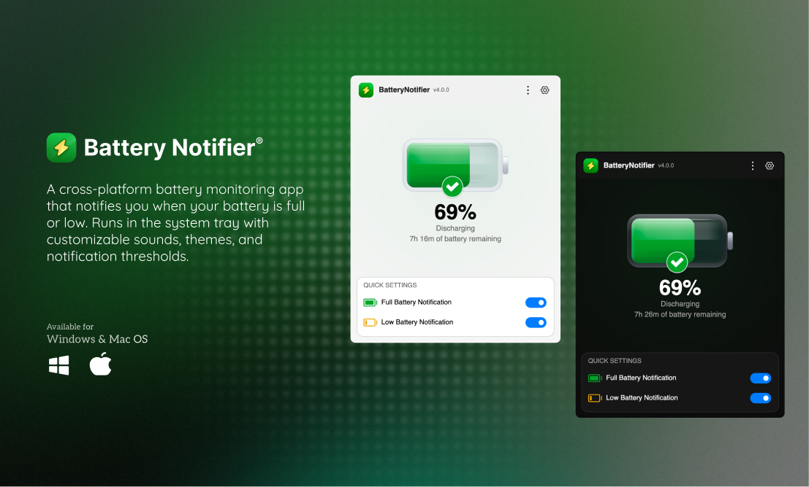

# Battery Notifier

A cross-platform battery monitoring app that notifies you when your battery is full or low. Runs in the system tray with customizable sounds, themes, and notification thresholds.

Built with **Avalonia UI** and **.NET 10** — works on **Windows**, **macOS**, and **Linux**.

Screenshot:



## Features

- **Battery notifications** — alerts when battery is full (while charging) or low (while discharging)
- **Customizable thresholds** — set your own full/low battery percentage triggers
- **Sound library** — built-in synthesized tones, bundled Editor's Choice sounds, or import your own
- **System tray** — runs quietly in the background, click to show/hide
- **DND-aware** — respects Do Not Disturb / Focus mode on all platforms
- **Themes** — System, Light, and Dark mode
- **Launch at startup** — auto-start with your OS
- **Escalating notifications** — Duolingo-inspired backoff so you're not spammed
- **Encrypted settings** — AES-256-GCM encrypted at rest

## Download

Grab the latest release from [GitHub Releases](https://github.com/Sandip124/BatteryNotifier/releases).

| Platform | Download |
|---|---|
| Windows x64 | `BatteryNotifier-win-x64.zip` |
| Windows ARM64 | `BatteryNotifier-win-arm64.zip` |
| macOS Apple Silicon | `BatteryNotifier-osx-arm64.tar.gz` |

## Build from Source

Requires [.NET 10 SDK](https://dotnet.microsoft.com/download).

```bash
# Build
dotnet build BatteryNotifier.sln

# Run
dotnet run --project BatteryNotifier.Avalonia/BatteryNotifier.Avalonia.csproj

# Test
dotnet test BatteryNotifier.Tests/

# Publish (self-contained)
dotnet publish BatteryNotifier.Avalonia/BatteryNotifier.Avalonia.csproj -c Release
```

## Sound Options

| Category | Sounds | Description |
|---|---|---|
| Built-in (synthesized) | Zen, Harp, Breeze, Bloom, Pulse, Klaxon, Rattle, Chime, Alert, Beacon | Short tones generated at runtime |
| Editor's Choice (bundled) | Rock N Roll, Admonition, Snowy Glow, Legacy | Curated music clips shipped with the app |
| Custom (imported) | Your files | Import any `.wav`, `.mp3`, `.m4a`, `.ogg`, `.flac`, or `.aac` file |

## License

[MIT](LICENSE)
